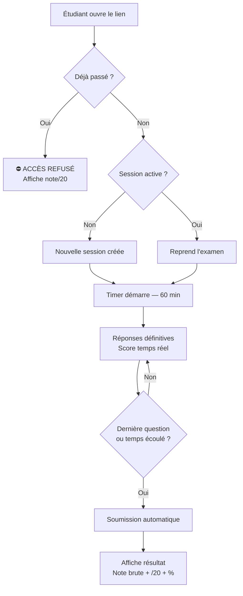

# 📋 Faisabilité Complète — Plateformes d'Examen en Ligne

> **Université d'Alger 2 — Abou El Kacem Saâdallah**  
> Faculté des Langues Étrangères — Département d'Allemand  
> Professeur : Mr Bouafia Rehabi — Session S2 — Année 2025/2026

---

## 🏗️ Architecture Technique

### Stack Technologique

| Composant | Technologie |
|-----------|-------------|
| **Backend** | Node.js 20 (Alpine) + Express 4.21 |
| **Base de données** | SQLite via `better-sqlite3` (embarquée, sans serveur) |
| **Frontend** | HTML5 / CSS3 / JavaScript Vanilla (aucun framework) |
| **Conteneurisation** | Docker (node:20-alpine) |
| **Déploiement** | Coolify sur VPS (187.124.173.103) |
| **DNS** | Hostinger (sous-domaines br-solution.tech) |
| **Versioning** | GitHub (br70-Solution) |

### Arborescence des Projets

```
ExamLinux/                          ExamOpenSource/
├── Dockerfile                      ├── Dockerfile
├── package.json                    ├── package.json
├── server.js                       ├── server.js
├── data/                           ├── data/
│   └── questions.json (140 Q)      │   └── questions.json (150 Q)
├── databases/                      ├── databases/
│   └── exam.db (auto-créé)         │   └── exam.db (auto-créé)
└── public/                         └── public/
    ├── index.html                      ├── index.html
    ├── admin.html                      ├── admin.html
    ├── results.html                    ├── results.html
    ├── css/style.css                   ├── css/style.css
    └── js/quiz.js                      └── js/quiz.js
```

---

## 🌐 Points d'Accès (URLs)

| Page | ExamLinux | ExamOpenSource |
|------|-----------|----------------|
| **Examen** | http://linux.br-solution.tech | http://opensource.br-solution.tech |
| **Admin** | http://linux.br-solution.tech/admin | http://opensource.br-solution.tech/admin |
| **Résultats publics** | http://linux.br-solution.tech/resultats | http://opensource.br-solution.tech/resultats |

---

## 🔌 API REST — Endpoints

| Méthode | Route | Description | Auth |
|---------|-------|-------------|------|
| `GET` | `/api/config` | Nombre de questions, titre, durée | Aucune |
| `POST` | `/api/login` | Connexion étudiant (nom+groupe) | Aucune |
| `GET` | `/api/questions` | Récupère les questions (sans réponses) | `X-Session-Token` |
| `POST` | `/api/answer` | Enregistre une réponse définitive | `X-Session-Token` |
| `POST` | `/api/submit` | Finalise l'examen et calcule la note | `X-Session-Token` |
| `GET` | `/api/my-score` | Score en temps réel pendant l'examen | `X-Session-Token` |
| `GET` | `/api/results` | Tous les résultats (admin) | `X-Admin-Password` |
| `GET` | `/api/results-public` | Classement public (soumis uniquement) | Aucune |
| `DELETE` | `/api/cleanup` | Purge totale de la base de données | `X-Admin-Password` |

---

## ✅ Fonctionnalités Implémentées

### 🎓 Côté Étudiant

| Fonctionnalité | Statut | Détails |
|----------------|--------|---------|
| Connexion par nom + groupe | ✅ | Validation min 3 caractères |
| Timer 60 minutes | ✅ | Compte à rebours avec alertes visuelles (orange <15min, rouge <5min) |
| Questions aléatoires | ✅ | Chargées depuis questions.json |
| Réponse définitive | ✅ | Impossible de modifier après sélection |
| Auto-avance | ✅ | Passe à la question suivante après 800ms |
| Score en temps réel | ✅ | Affiché en haut pendant l'examen |
| Soumission automatique | ✅ | À la fin du temps OU après la dernière question |
| Reprise de session | ✅ | Si l'étudiant est déconnecté, il peut reprendre |
| **Blocage anti-doublon** | ✅ | ⛔ Empêche de repasser l'examen |
| Affichage note/20 | ✅ | Score brut + note/20 + pourcentage |
| Page résultats | ✅ | Classement public accessible |

### 👨‍🏫 Côté Professeur (Admin)

| Fonctionnalité | Statut | Détails |
|----------------|--------|---------|
| Authentification admin | ✅ | Mot de passe : `prof2026` |
| Dashboard temps réel | ✅ | Actualisation automatique toutes les 10s |
| Statistiques globales | ✅ | Terminés, En cours, Moyenne, Taux de réussite |
| Tableau des candidats | ✅ | Nom, Groupe, Note brute, **Note/20**, %, Statut, Durée |
| Recherche/Filtrage | ✅ | Par nom ou groupe |
| Export CSV | ✅ | Nom, Groupe, Note, Total, **Note_sur_20**, %, Statut |
| Purge des données | ✅ | Suppression totale (irréversible, avec confirmation) |

---

## 🛡️ Sécurité

| Mesure | Détail |
|--------|--------|
| **Réponses masquées** | Le serveur ne renvoie jamais les `correct` dans `/api/questions` |
| **Session UUID** | Token unique par étudiant, impossible à deviner |
| **Anti-doublon** | Le serveur vérifie `submitted=1` et renvoie 409 si déjà passé |
| **Formulaire désactivé** | Si bloqué, tous les champs sont grisés (impossible de contourner côté client) |
| **Admin protégé** | Mot de passe vérifié par header sur chaque requête |
| **SQLite WAL** | Write-Ahead Logging pour éviter les corruptions en accès concurrent |

---

## 📊 Contenu des Examens

### ExamLinux — 140 Questions

| Catégorie | Nombre |
|-----------|--------|
| Commandes de base | 28 |
| Système de fichiers | 18 |
| Permissions | 14 |
| Réseau | 11 |
| Manipulation texte | 10 |
| Utilisateurs | 9 |
| Commande mv | 8 |
| Processus | 8 |
| Concepts Linux | 7 |
| Administration | 5 |
| Gestion paquets | 5 |
| Disque | 5 |
| Recherche | 4 |
| Éditeurs | 4 |
| Archivage | 4 |

### ExamOpenSource — 150 Questions

| Catégorie | Couverture |
|-----------|-----------|
| Histoire du logiciel libre | GNU, FSF, Stallman, Torvalds |
| Licences | GPL, MIT, Apache, BSD, Creative Commons |
| Open Source vs Libre | Définitions, philosophie, modèles économiques |
| Outils & projets | Linux, Firefox, LibreOffice, Git, etc. |

---

## 🔄 Cycle de Vie d'un Examen



---

## 🚀 Déploiement (Coolify)

### Configuration par application

| Paramètre | Valeur |
|-----------|--------|
| **Source** | GitHub (br70-Solution/ExamLinux ou ExamOpenSource) |
| **Branch** | `main` |
| **Build** | Dockerfile |
| **Port exposé** | 3000 |
| **Volume persistant** | `/app/databases` |
| **Domaine** | `linux.br-solution.tech` / `opensource.br-solution.tech` |

### Procédure de mise à jour
1. Modifier le code localement
2. `git add -A && git commit -m "message" && git push origin main`
3. Dans Coolify → cliquer **Deploy** sur l'application concernée
4. Attendre le build Docker (~30s) et la mise en ligne

---

## 🧹 Maintenance

| Action | Comment |
|--------|---------|
| **Avant un examen** | Aller sur `/admin` → Purger les données (icône 🗑️) |
| **Après un examen** | Aller sur `/admin` → Exporter CSV avant de purger |
| **Changer le mot de passe** | Variable d'environnement `ADMIN_PASSWORD` dans Coolify |
| **Modifier les questions** | Éditer `data/questions.json` → push → redéployer |
| **Changer la durée** | Variable d'environnement `DURATION_MINUTES` dans Coolify |

---

## 📱 Compatibilité

| Plateforme | Support |
|-----------|---------|
| Chrome (Desktop/Mobile) | ✅ |
| Firefox | ✅ |
| Safari (iOS) | ✅ |
| Edge | ✅ |
| Responsive Mobile | ✅ |

---

## ⚠️ Limites Connues

| Limite | Impact | Mitigation |
|--------|--------|-----------|
| SQLite mono-serveur | ~100 étudiants simultanés max | Suffisant pour une classe |
| Pas de HTTPS natif | Données en clair | Coolify peut ajouter un certificat SSL |
| Mot de passe admin en dur | Sécurité basique | Utiliser les variables d'environnement Coolify |
| Pas de mélange d'ordre | Tous les étudiants voient le même ordre | Ajout futur possible |
| Pas de rattrapage intégré | Purge nécessaire entre sessions | Exporter CSV avant purge |

---

## 💰 Coût

| Élément | Coût |
|---------|------|
| VPS (héberge Coolify) | Existant |
| Domaine br-solution.tech | Existant (Hostinger) |
| GitHub repos | Gratuit |
| Node.js / SQLite | Open source, gratuit |
| **Total** | **0 € supplémentaire** |
